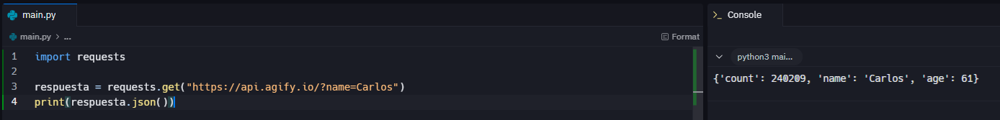

# Documentación Python Básico para Nuevos Desarrolladores II

Este documento está diseñado para personas que se inician en el mundo de la programación y buscan comprender algunos conceptos fundamentales de Python y de herramientas modernas utilizadas en desarrollo de software. Cada sección incluye explicaciones detalladas y ejemplos prácticos para facilitar el aprendizaje.

---

## ¿Para qué usamos Clases en Python?

Las **clases en Python** son una herramienta fundamental de la programación orientada a objetos. Nos permiten crear planos que definen cómo serán los objetos, tanto en su **estructura de datos** como en sus **funcionalidades**. Esto ayuda a organizar el código, evitando la repetición y facilitando el mantenimiento de programas grandes y complejos.

Usamos clases porque representan de manera natural entidades del mundo real. Por ejemplo, si estamos desarrollando un videojuego, podemos crear clases que representen a los personajes, cada uno con sus caracteristicas como el nivel o habilidades, y métodos que describan sus acciones. Así, el código se vuelve más intuitivo, ya que podemos pensar en términos de "personajes" o "objetos" en lugar de simples números o cadenas de texto.

Además, las clases fomentan la reutilización del código: a partir de una misma clase podemos crear múltiples instancias (objetos) con características propias, sin necesidad de escribir código repetitivo. Esto las convierte en una herramienta clave para construir aplicaciones escalables y fáciles de extender.

En el siguiente ejemplo creamos la clase Personaje, que actúa como plantilla para definir personajes de un videojuego. El método especial __init__ se usa para inicializar sus caracteristicas: nombre, nivel y habilidad. Así, cada vez que instanciamos un personaje, podemos personalizar sus características.

Posteriormente se definen dos personajes: Verso y Maelle, cada uno con diferentes valores. Ambos comparten la misma estructura, pero con atributos propios.

El método usar_habilidad permite que cada personaje realice una acción, mostrando en pantalla su nombre y la habilidad que utiliza. Este ejemplo demuestra cómo las clases permiten representar entidades de un juego de forma clara y organizada.

### Ejemplo de clases:

```python
class Personaje:
    def __init__(self, nombre, nivel, habilidad):
        self.nombre = nombre
        self.nivel = nivel
        self.habilidad = habilidad

    def usar_habilidad(self):
        return f"{self.nombre} usa {self.habilidad}!"

verso = Personaje("Verso", 99, "End Bringer")
maelle = Personaje("Maelle", 99, "Stendhal")

print(verso.usar_habilidad())
print(maelle.usar_habilidad())
```

### Ejemplo gráfico de clases


---

## ¿Qué método se ejecuta automáticamente cuando se crea una instancia de una clase?

En Python, cuando se crea un nuevo objeto de una clase, se ejecuta automáticamente el método especial `__init__`, conocido como **constructor**. Este método sirve para inicializar el objeto, asignando valores a sus atributos y preparándolo para su uso inmediato.

La ventaja de `__init__` es que podemos pasarle argumentos desde el momento de la creación de la instancia, en lugar de tener que configurar manualmente cada atributo después. Esto hace que el código sea más compacto, legible y menos propenso a errores.

En la práctica, este método nos permite definir cómo queremos que nazcan nuestros objetos y asegurarnos de que siempre empiecen en un estado válido y consistente.

En el siguiente ejemplo, la clase Persona se crea con un método __init__ que recibe el nombre y la edad como parámetros. Este constructor inicializa las variables de instancia para que cada objeto tenga su información propia.

Cuando se crea p1 = Persona("Verso", 33), automáticamente se ejecuta el __init__ y se asignan los valores "Verso" y 33 a los atributos nombre y edad.

Luego, el método presentarse devuelve una cadena personalizada. Así se observa cómo el constructor facilita la creación de objetos con valores iniciales sin necesidad de pasos adicionales.

### Ejemplo de __init__:

```python
class Persona:
    def __init__(self, nombre, edad):
        self.nombre = nombre
        self.edad = edad

    def presentarse(self):
        return f"Hola, soy {self.nombre} y tengo {self.edad} años."

p1 = Persona("Verso", 33)
print(p1.presentarse())
```

### Ejemplo gráfico de __init__


---

## ¿Cuáles son los tres verbos de API?

En las **APIs REST**, que son las más comunes hoy en día, se utilizan principalmente tres verbos HTTP: **GET**, **POST** y **DELETE**. Cada uno indica al servidor qué tipo de operación debe realizar.

- **GET** se usa para solicitar información, sin modificar datos en el servidor.
- **POST** sirve para enviar nuevos datos, como al registrarte en un formulario.
- **DELETE** permite eliminar información, por ejemplo, borrar un comentario en una aplicación.

Estos verbos son muy importantes porque aseguran que las aplicaciones se comuniquen de forma clara y estructurada. Al seguir estas convenciones, se facilita la interacción entre sistemas distintos.

En el ejepmlo se utiliza la librería requests para hacer una petición GET al sitio https://api.github.com. El verbo GET le indica al servidor que queremos obtener información sin modificar nada.

El método requests.get() devuelve un objeto de respuesta, del que podemos consultar el atributo status_code. En este caso, un valor 200 significa que la petición fue exitosa.

Este ejemplo sirve para mostrar cómo un programa en Python puede comunicarse con un servidor mediante una API y recibir información estructurada.

### Ejemplo GET:

```python
import requests

respuesta = requests.get("https://api.github.com")
print(respuesta.status_code)
```

### Ejemplo gráfico de GET


---

## ¿Es MongoDB una base de datos SQL o NoSQL?

**MongoDB es una base de datos NoSQL**, lo que significa que no utiliza tablas con filas y columnas como las bases de datos SQL tradicionales. En lugar de ello, almacena los datos en **documentos** con un formato muy parecido a JSON.

Esto ofrece gran flexibilidad, ya que no se necesita definir un esquema fijo antes de guardar los datos. Así, documentos dentro de la misma colección pueden tener distintos campos, lo cual es ideal para aplicaciones que manejan datos variables o en constante evolución.

Gracias a estas características, MongoDB es muy popular en proyectos web modernos, aplicaciones móviles y sistemas que requieren manejar grandes volúmenes de datos con rapidez y escalabilidad.

En el ejemplo, se muestra un documento en formato JSON con los campos nombre, edad y ciudad. A diferencia de las bases de datos SQL, donde los datos se almacenan en tablas con filas y columnas, MongoDB guarda información en documentos como este.

Cada documento puede tener campos diferentes, lo que ofrece gran flexibilidad. Por ejemplo, otro documento en la misma colección podría incluir un campo adicional como "profesión".

Esto hace que MongoDB sea muy útil para aplicaciones que necesitan manejar información variable o cambiar su estructura de datos con frecuencia sin necesidad de migraciones complicadas.

### Ejemplo de documento en MongoDB:

```json
{
  "nombre": "Carlos",
  "edad": 25,
  "ciudad": "Madrid"
}
```

---

## ¿Qué es una API?

Una **API (Application Programming Interface)** es un conjunto de reglas que permite que dos aplicaciones se comuniquen entre sí. Sirve como un puente entre diferentes programas o servicios, permitiendo que compartan datos y funcionalidades sin necesidad de conocer su funcionamiento interno.

Gracias a las APIs, los desarrolladores pueden crear aplicaciones más completas y útiles sin reinventar la rueda. Por ejemplo, una app de viajes puede usar la API de Google Maps para mostrar rutas y ubicaciones sin tener que programar desde cero un sistema de mapas.

Las APIs son fundamentales en el desarrollo moderno porque promueven la interoperabilidad y la reutilización de recursos entre distintos sistemas.

Aquí usamos la librería requests para consultar la API agify.io, que estima la edad promedio de las personas según su nombre. Al pasar el parámetro name=Carlos, el servidor devuelve un objeto JSON con información relacionada.

El método .json() convierte la respuesta en un diccionario de Python, lo que nos permite acceder fácilmente a los valores.

Este ejemplo ilustra cómo las APIs permiten que aplicaciones externas proporcionen información útil que podemos integrar directamente en nuestros programas.

### Ejemplo de API:

```python
import requests

respuesta = requests.get("https://api.agify.io/?name=Carlos")
print(respuesta.json())
```

### Ejemplo gráfico de API


---

## ¿Qué es Postman?

**Postman** es una herramienta que facilita el trabajo con APIs, permitiendo a los desarrolladores y testers enviar peticiones a un servidor y ver las respuestas de manera clara. Es muy útil porque no requiere escribir código para realizar estas pruebas, lo que acelera el proceso de desarrollo.

Con Postman se pueden organizar pruebas en colecciones, compartirlas con otros miembros del equipo y automatizar escenarios de prueba. Esto la convierte en una herramienta esencial en equipos que trabajan con APIs de forma constante.

Además, Postman ayuda a identificar errores y validar que las APIs funcionan correctamente antes de integrarlas en una aplicación, ahorrando tiempo y evitando problemas posteriores.

### Ejemplo gráfico de Postman


---

## ¿Qué es el polimorfismo?

El **polimorfismo** es un principio clave de la programación orientada a objetos que significa “muchas formas”. Permite que diferentes clases utilicen el mismo método pero lo implementen de manera distinta según sus características.

Esto resulta útil porque podemos tratar diferentes objetos de manera uniforme sin preocuparnos por sus detalles internos.

De esta manera, el polimorfismo fomenta la reutilización del código y hace que los programas sean más flexibles y fáciles de expandir.

En este caso, el polimorfismo se muestra a través del método especial __init__, que todas las clases comparten pero implementan de manera diferente.

La clase base Animal inicializa únicamente el atributo nombre, mientras que las clases hijas Perro y Gato amplían la inicialización sobre escribiendo el método ‘hacer_sonido’, para que este método ahora muestre “Monoco hace Guau!” en lugar de “El animal hace algún sonido”, en el caso de el perro llamado Monoco y "Esquie hace Miau!" en el caso del gato llamado Esquie. Para no repetir la lógica, ambas usan super().__init__(nombre), que llama al constructor de la clase padre y asegura que el atributo nombre se asigne correctamente.

Luego, al recorrer la lista de animales, cada objeto conserva su propia implementación de __init__, y muestra mensajes personalizados. Este ejemplo ilustra cómo el polimorfismo permite reutilizar el mismo método en clases relacionadas, adaptándolo a las necesidades de cada una.

### Ejemplo de polimorfismo:

```python
class Animal:
    def __init__(self, nombre):
        self.nombre = nombre

    def hacer_sonido(self):
        print("El animal hace algun sonido")

class Perro(Animal):
    def __init__(self, nombre):
        super().__init__(nombre)
    
    def hacer_sonido(self):
        print(f"{self.nombre} hace Guau!")

class Gato(Animal):
    def __init__(self, nombre):
        super().__init__(nombre)
    
    def hacer_sonido(self):
        print(f"{self.nombre} hace Miau!")

animales = [Perro("Monoco"), Gato("Esquie")]
for animal in animales:
    animal.hacer_sonido()
```

### Ejemplo gráfico de polimorfismo


---

## ¿Qué es un método dunder?

Los **métodos dunder** son funciones especiales en Python que comienzan y terminan con dos guiones bajos, como `__init__`, `__str__` o `__len__`. El nombre proviene de *double underscore*.

Estos métodos no suelen llamarse directamente, sino que Python los ejecuta en situaciones específicas. Por ejemplo, cuando usamos la función `print()` sobre un objeto, si este tiene definido el método `__str__`, se mostrará el texto que hayamos configurado allí.

De esta manera, los métodos dunder nos permiten personalizar cómo se comportan nuestros objetos al interactuar con funciones y operadores nativos de Python.

En el ejemplo, la clase Libro tiene tres métodos dunder:

__init__: inicializa los atributos titulo y paginas.

__str__: define el texto que se muestra cuando imprimimos el objeto con print().

__len__: permite que la función nativa len() devuelva el número de páginas.

De esta forma, el objeto mi_libro se comporta como si fuera parte nativa de Python, mostrando información útil y respondiendo a funciones habituales como len().

### Ejemplo de método dunder:

```python
class Libro:
    def __init__(self, titulo, paginas):
        self.titulo = titulo
        self.paginas = paginas

    def __str__(self):
        return f"Libro: {self.titulo}, {self.paginas} páginas"

    def __len__(self):
        return self.paginas

mi_libro = Libro("Python Básico", 250)
print(mi_libro)
print(len(mi_libro))
```

### Ejemplo gráfico de método dunder


---

## ¿Qué es un decorador de Python?

Un **decorador** es una función especial que permite añadir funcionalidades adicionales a otra función sin modificar directamente su código. Se definen con el símbolo `@` antes de la función a decorar.

Los decoradores son muy útiles porque permiten reutilizar lógica común, como registrar llamadas a funciones, comprobar permisos o modificar salidas, sin tener que duplicar código en cada función. Esto hace que el código sea más modular y limpio.

Se usan ampliamente en frameworks como Flask y Django, donde decoradores como `@app.route` permiten definir rutas web de forma sencilla y legible.

En el ejemplo, se crea un decorador llamado mayusculas que recibe una función como argumento. Dentro, define una función interna envoltura() que llama a la función original y transforma su resultado a mayúsculas antes de devolverlo.

El decorador se aplica a la función saludar usando @mayusculas. De esta manera, cuando llamamos a la funcion decorada saludar(), el texto "hola mundo" se transforma automáticamente en "HOLA MUNDO".

### Ejemplo de decorador:

```python
def mayusculas(funcion):
    def envoltura():
        resultado = funcion()
        return resultado.upper()
    return envoltura

@mayusculas
def saludar():
    return "hola mundo"

print(saludar())
```

### Ejemplo gráfico de decorador

